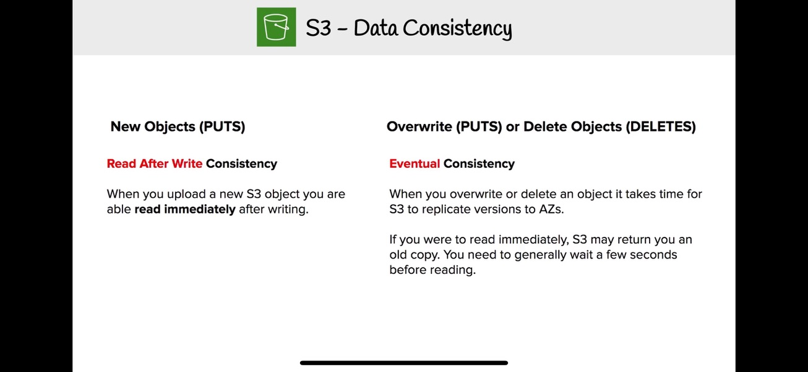
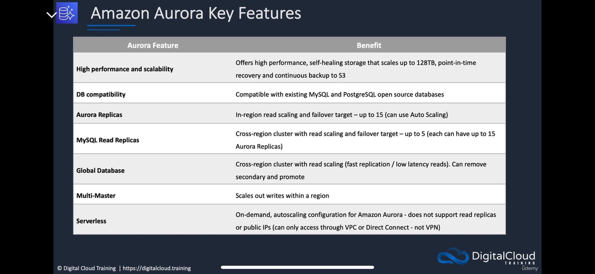
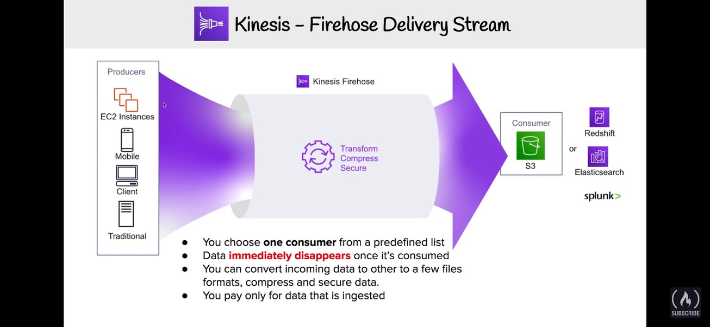
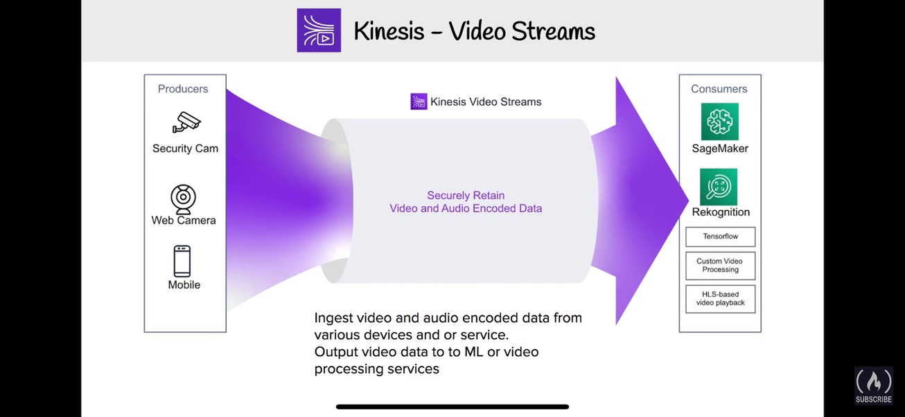
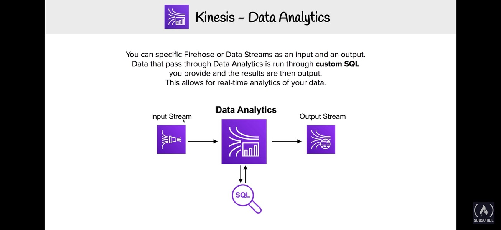
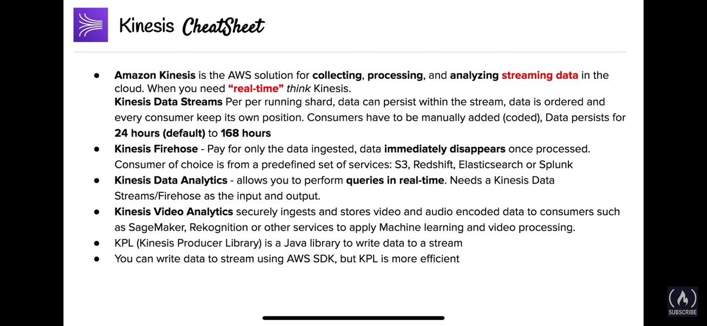

1. re-watch bought Udemy courses
2. review notes in Udemy
3. watch AWS SkillBuilder Exam Prep
4. Practice Exams (Udemy, AWS SkillBuilder, YT (watch))
5. review Exam Prep PDFs ([AWS+Cloud+Practitioner+Exam+Cram](AWS+Cloud+Practitioner+Exam+Cram.pdf) and [AWS+CSAA+Exam+Cram](AWS+CSAA+Exam+Cram.pdf))
6. If there is a new new Version of the exam -> review changes
7. have a look at the exam guide and look at the list of included Services and check if there are unfamiliar services

# General Things I always forgot and should have a look at it
- Difference between Guard Duty and Detective
  
- AWS Inspector
- Trusted Advisor
- S3 can serve static websites but Cloudfront can serve static and dynamic content
- EBS Volume types (which ha how much IOPS) https://docs.aws.amazon.com/AWSEC2/latest/UserGuide/ebs-volume-types.html
- Differences between EFS, Fsx for windows (keyword SMB), Fsx for lustre (high performance computing and you can integrate it in s3)
- Differences between Storage Gateway (file Gateway, storage gateway) (some caching locally, some have the data locally and backup in the cloud) https://aws.amazon.com/storagegateway/
- Pricing Options (Spot Instances, Reserved Instances, Saving Plans, Dedicated Instances, Dedicated Hosts (keyword licenses per socket), On-Demand)
  
- review On-Demand Capacity reservations (ensure you get the needed capacity but no price reduction https://docs.aws.amazon.com/AWSEC2/latest/UserGuide/ec2-capacity-reservations.html#capacity-reservations-differences)
- Well Architected Framework https://aws.amazon.com/architecture/well-architected/
- Cloud Adoption Framework https://aws.amazon.com/cloud-adoption-framework/
	- Perspectives (Business, People, Governance, Platform, Security, Operations)
	- Phases (Envision, Align, Launch, Scale)
- AWS Transit Gateway (connects your Amazon Virtual Private Clouds (VPCs) and on-premises networks through a central hub (no mesh needed)) https://aws.amazon.com/transit-gateway/
- AWS Private Link (Establish connectivity between VPCs and AWS services without exposing data to the internet) https://aws.amazon.com/privatelink/
- VPC Gateway Endpoint for DynamoDB and S3 (connect via private connection) (often Used with PrivateLink)
- Differences between Interface VPC Endpoint (not free, uses ENIs, many AWS services) and Gateway VPC (free, only for S3 and DynamoDB)
- EC2 Placement Groups (cluster (low-latency), spread, partition)
- 
- ENI vs EFA (low latency)
- RDS Proxy (maintains a pool of established connections to your RDS database instances, reducing the stress on database compute and memory resources that typically occurs when new connections are established; and connects to a faiobver DB nstance) https://aws.amazon.com/rds/proxy/
- "Virtual Private Gateway (VPG)" on AWS site and "Customer Gateway" on on-premises site
- Disaster Recovery (backup and restore, Pilot Light, Warm standby and Multi-Site) and which one takes how long for RTO and RPO https://docs.aws.amazon.com/whitepapers/latest/disaster-recovery-workloads-on-aws/disaster-recovery-options-in-the-cloud.html
- AWS Elastic Disaster Recovery Service
- Lambda for max 15 minute runs
- Cloudfront Functions vs Lambda@Edge
- EMR for Managed Apache Hadoop and Spark
- OpsWork for Chef / Puppet
- differences between NACLs (stateless, allow and deny, priority, per subnet) and Security Groups (stateful, only allow, per instance)
- differences between Security Groups/NACLs created by default and manually created
	- default NACL: 
		- Inbound allow: all traffic on all ports with all protocols and all sources (priority 100)
		- Inbound deny: all traffic on all ports with all protocols and all sources (priority * (highest))
		- Outbound allow: all traffic on all ports with all protocols and all sources (priority 100)
		- Outbound deny: all traffic on all ports with all protocols and all sources (priority * (highest))
	- custom NACL:
		- Inbound allow: -
		- Inbound deny: all traffic on all ports with all protocols and all sources (priority * (highest))
		- Outbound allow: -
		- Outbound deny: all traffic on all ports with all protocols and all sources (priority * (highest))
	- default Security Group:
		- Inbound allow: all traffic on all ports with all protocols and the own security group itself as source
		- Outbound allow: all traffic on all ports with all protocols and all sources
	- custom Security Group:
		- Inbound allow: -
		- Outbound allow: -
- All common ML and AI Tools (SageMaker, Transcribe, Translate, Comprehend, Textract, Polly, Lex, Recognition, Kendra etc...)
- S3 Lifecycles
- S3 Data consistency 
- Specials for S3 (Lifecycle, Cross Region replication, Versioning, MFA Delete, Transfer Acceleration, Multipart Upload, Presigned URLs)
- Specials for DynamoDB (DAX, Data Streams, Global Tables)
- RDS vs Aurora
- RDS scaling
- Multi-AZ
- Aurora Multi-AZ can be used as read replica, normal RDS only as failover
- Multi-AZ synchronous replication
- Read Replica asynchronous replication
- Aurora Key Deatures 
- special DBs (Neptune (Graph), QLDB (immutable Data), Keyspaces (Cassandra), DocumentDB (MongoDB))
- Redis vs Memcached for Elasticache 
- Kinesis for Real-Time Data (check Shards, Partitions, Kineses Data Stream, Firehouse et..)
  
  
  
  
  
- Differences between Cognito User and Identity Pools