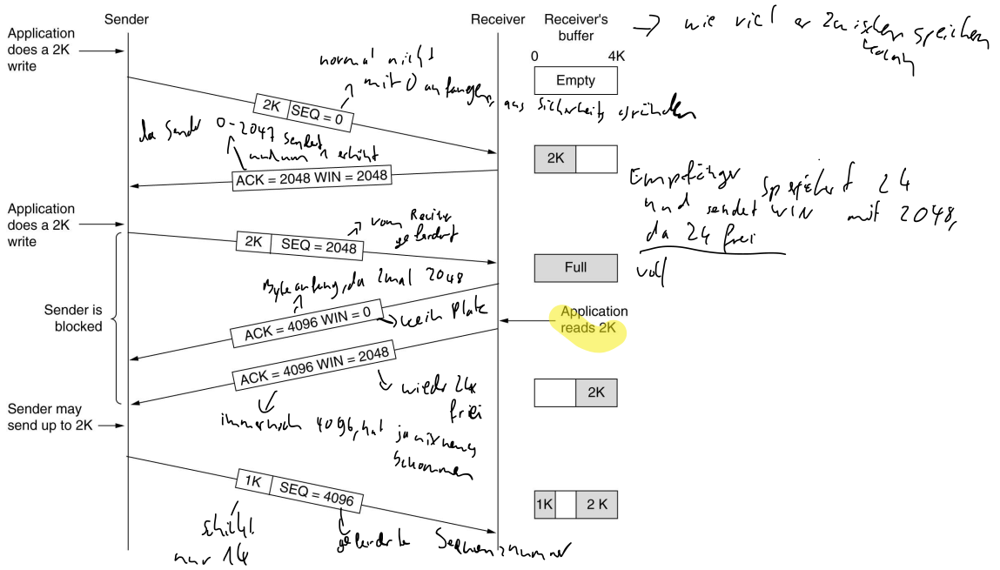

# Transport Layer
- Interface for communication with applications (e.g. addressing)
- Multiplexing from one IP address to multiple applications on target computers
- "higher" layers of the [OSI-Model](OSI-Model.md) could assume a **process-to-process** connection
- handles errors of [3-Network-Layer](3-Network-Layer.md)
- Possible tasks of the transport layer:
	- Error detection by checksums and acknowledgements.
	- Complex connection control, since it is not clear whether a partner exists.
	- Data buffering, because of intermediate storage in the network.
	- Data protection
	- Flow control
- sends segments (see [Encapsulation](OSI-Model.md#Encapsulation))

## TCP
- **T**ransmission **C**ontrol **P**rotocol
- reliable established connection (connection oriented)
- connection should be closed once transmission is complete ([TCP Three-way Hanyshake](4-Transport-Layer.md#TCP%20Three-way%20Hanyshake) and [TCP Teardown](4-Transport-Layer.md#TCP%20Teardown))
- Able to sequence
- Can guarantee delivery of data to the destination
- Retransmission of lost packets
- Extensive error checking and acknowledgment of data
-  Does not support Broadcasting
- optimal usage: HTTP(s), SMTP, FTP etc.

### TCP Three-way Hanyshake
```
Client                                        Server
   │                                             │
   ├────────┐                                    │
   │        └────────┐SYN(seq=x)                 │
   │                 └────────┐                  │
   │                          └────────┐         │
   │                                   └────────►│
   │                                             │
   │                                             │
   │                                             │
   │           SYN(seq=y)+ACK(ack=x+1)  ┌────────┤
   │                           ┌────────┘        │
   │                  ┌────────┘                 │
   │         ┌────────┘                          │
   │◄────────┘                                   │
   │                                             │
   │                                             │
   │                                             │
   ├────────┐                                    │
   │        └────────┐ACK(ack=y+1)               │
   │                 └────────┐                  │
   │                          └────────┐         │
   │                                   └────────►│
   │                                             │
```
1. the clients wants to establish a connection with the server and sends a segment with SYN Flag (**Sy**nchronize Sequence **N**umber) which informs the server that the client is likely to start communication and with what sequence number its starts segments with
2. Server responds to client with SYN+ACK. 
   - ACK (**Ack**nowledgement) Number contains the number of the next expected byte and confirms the receipt of previous client segment (x)
   -  SYN Flagwith what sequence number its starts segments with
3. ACK confirms the receipt of previous server segment and contains the number of tzhe next expected bytes

### TCP Teardown
```
Client                                        Server
   │                                             │
   ├────────┐     FIN(1)+SEQ(m)                  │
   │        └────────┐                           │
   │                 └────────┐                  │
   │                          └────────┐         │
   │                                   └────────►│
   │                                             │
   │                                             │
   │                                             │
   │                                    ┌────────┤
   │                  ACK(m+1) ┌────────┘        │
   │                  ┌────────┘                 │
   │         ┌────────┘                 ┌────────┤
   │◄────────┘   FIN(1)+SEQ(n) ┌────────┘        │
   │                  ┌────────┘                 │
   │         ┌────────┘                          │
   │◄────────┘                                   │
   │                                             │
   │                                             │
   ├────────┐                                    │
   │        └────────┐ACK(n+1)                   │
   │                 └────────┐                  │
   │                          └────────┐         │
   │                                   └────────►│
   │                                             │
```
The grateful connection relaese (without abruption) uses TCP Header FIN Flag
1. Suppose that the client application decides it wants to close the connection. (Note that the server could also choose to close the connection), the client sends a TCP segment with FIN bit set to 1 to the server. it will accept no more data
2. server acknowledges the FIN
3. server sens his own FIN (a little bit later because the server closing process)
4. client can confirm the FIN of the server

### TCP Flow control
- uses field window size
- sender sends data 
- receiver saves data in buffer
- receiver sends ACK acknowledgment with number of next expected bit and WIN window size with the amount buffer capacity
- client sends next data with sequence number (but if server buffer is full (WIN=0), the sender is blocked until server sends new segment with a window size > 0)


## UDP
- **U**ser **D**atagram **P**rotocol
- not reliable and connectionless
- simple and faster than [TCP](4-Transport-Layer.md#TCP)
- no requirements for opening, maintaining, or terminating a connection
- Unable to sequence
- Cannot guarantee delivery of data to the destination
- No retransmission of lost packets
- Basic error checking mechanism using checksums
- Does support Broadcasting
- optimal usages: Video conferencing, streaming, DNS, VoIP

## Ports
- Identification of applications
- numeric value assigned to a specific process or application in the device
- `<ip/domain>:PORT` e.g. 127.0.0.1:8080
- a lot of port numbers are reserved for specific protocols / applications (e.g. 21 FTP, 22 SSH, 80 HTTP, 443 HTTPS)
- valid port numbers: 0 - 65535 (= 2^16-1)
	- well-known ports 0 - 1023
		- reserverd for system and network services 
	- user ports 1024 - 49151
		- ports intended for registered services, but can also be used for all other client programs
	- dynamic ports 49152 - 65535
		- assigned to client programs bya the [Operating-Systems](../../Operating-Systems/Operating-Systems.md)

## Sockets
- associated with [Ports](4-Transport-Layer.md#Ports)
- interface to send and receive data on a particular port

### Socket API
|Methode|Description|
|-------|-----------|
|Socket |Create new communication endpoint|
|Bind   |Attach local adsress to a socket|
|Listen |Announce willingness to accept connections|
|Accept |Accept a connection attempt|
|Connect|Actively attempt to establish a connection|
|Send   |Send data over the connection|
|Receive|Receive data from the connection|
|Close  |Release the connection|

### Socket Flow
```
┌─────────┐                         ┌─────────┐
│socket() │                         │socket() │
└────┬────┘                         └────┬────┘
     │                                   │
┌────▼────┐                              │
│bind()   │                              │
└────┬────┘                              │
     │                                   │
┌────▼────┐                              │
│listen() │                              │
└────┬────┘                              │
     │         Connection Setup          │
┌────▼────┐    (3-way handshake)    ┌────▼────┐
│accept() │◄───────────────────────►│connect()│
└────┬────┘                         └────┬────┘
     │                                   │
┌────▼────┐                         ┌────▼────┐
│receive()◄───┐                 ┌───►send()   │
└────┬────┘   │                 │   └────┬────┘
     │        │                 │        │
┌────▼────┐   │                 │   ┌────▼────┐
│send()   ├───┘                 └───┤receive()│
└────┬────┘                         └────┬────┘
     │       Connection Termination      │
┌────▼────┐        (Teardown)       ┌────▼────┐
│close()  │◄───────────────────────►│close()  │
└─────────┘                         └─────────┘
```


## TCP Segment
```
0               8               16              24              31 = 32Bits = 4Bytes
│ │ │ │ │ │ │ │ │ │ │ │ │ │ │ │ │ │ │ │ │ │ │ │ │ │ │ │ │ │ │ │ │
└─┴─┴─┴─┴─┴─┴─┴─┴─┴─┴─┴─┴─┴─┴─┴─┴─┴─┴─┴─┴─┴─┴─┴─┴─┴─┴─┴─┴─┴─┴─┴─┘

┌───────────────────────────────┬───────────────────────────────┐
│Source Port                    │Destination Port               │ 4Bytes
├───────────────────────────────┴───────────────────────────────┤
│Sequence Number                                                │ 4Bytes
├───────────────────────────────────────────────────────────────┤
│Acknowledgement Number                                         │ 4Bytes
├───────┬───────────┬─┬─┬─┬─┬─┬─┬───────────────────────────────┤
│TCP   │           │U│A│P│R│S│F│                               │
│Header │6 Reserved │R│C│S│S│Y│I│Window Size                    │ 4Bytes
│Length │Bits       │G│K│H│T│N│N│                               │ (doppelt so breit wegen Flag-Darstellung)
├───────┴───────────┴─┴─┴─┴─┴─┴─┼───────────────────────────────┤
│Checksum                       │Urgent Pointer                 │ 4Bytes
├───────────────────────────────┴───────────────────────────────┤
│Options                                                        │ 0-320Bits in 32 Bit units
├───────────────────────────────────────────────────────────────┤
│Data                                                           │
└───────────────────────────────────────────────────────────────┘
```

- Source and Destination Port: [Ports](4-Transport-Layer.md#Ports)
- Sequence Number:  
	-   If the SYN flag is set (1), then this is the initial sequence number. The sequence number of the actual first data byte and the acknowledged number in the corresponding ACK are then this sequence number plus 1.
	-   If the SYN flag is clear (0), then this is the accumulated sequence number of the first data byte of this segment for the current session.
- Acknowledgement Number: If the ACK flag is set then the value of this field is the next sequence number that the sender of the ACK is expecting.
- TCP Header Length: length of TCP Header
- 6 Reserved Bits: for future use and should be set to 0
- Flags:
	- URG: Indicates that the Urgent pointer field is significant
	- ACK: Indicates that the Acknowledgment field is significant. All packets after the initial SYN packet sent by the client should have this flag set
	- PSH: Push function. Asks to push the buffered data to the receiving application
	- RST: Reset the connection
	- SYN: Synchronize sequence numbers. Only the first packet sent from each end should have this flag set
	- FIN: Last packet from sender
- Window Size: size of a window the sender is willing to accept
- Checksum: error-checking of the TCP header and payload
- Urgent Pointer: If the URG flag is set, then this 16-bit field is an offset from the sequence number indicating the last urgent data byte
- Options: not often used
- Data: Payload


